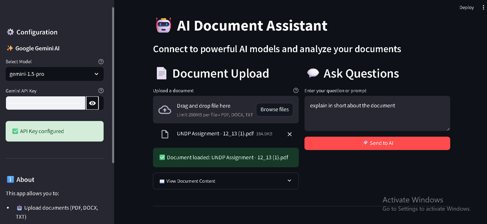

# 🤖 AI Document Assistant - Lab 2B

A beautiful Streamlit application that connects to external LLM models (Google Gemini) to analyze documents and answer questions.

## 📸 Screenshot



## ⚡ Quick Start

```bash
# Install dependencies
pip install -r requirements.txt

# Run the app
streamlit run app.py
```

Then enter your Gemini API key in the sidebar or configure it in a `.env` file.

## 📋 Features

- **Multi-Model Support**: Connect to Google's Gemini models (Gemini 1.5 Pro, Flash, 1.0 Pro)
- **Document Upload**: Support for PDF, DOCX, and TXT files
- **Document Analysis**: Extract and analyze document content
- **Interactive Chat**: Ask questions about your documents
- **Beautiful UI**: Clean and intuitive Streamlit interface
- **Conversation History**: Track your interactions with the AI
- **Secure**: API keys are handled securely and not stored
- **FREE API**: Google Gemini offers generous free tier

## 🚀 Getting Started

### Prerequisites

- Python 3.8 or higher
- Google Gemini API key ([Get one FREE here](https://makersuite.google.com/app/apikey))

### Installation

1. **Clone the repository**

   ```bash
   git clone <your-repo-url>
   cd Calling_AI_Model-
   ```

2. **Create a virtual environment** (recommended)

   ```bash
   python -m venv venv

   # On Windows
   venv\Scripts\activate

   # On macOS/Linux
   source venv/bin/activate
   ```

3. **Install dependencies**

   ```bash
   pip install -r requirements.txt
   ```

4. **Configure API key**

   Option 1: Using .env file (recommended)

   ```bash
   # Copy the example file
   copy .env.example .env  # On Windows
   # or
   cp .env.example .env    # On macOS/Linux

   # Edit .env and add your Gemini API key
   GEMINI_API_KEY=your_actual_api_key_here
   ```

   Option 2: Enter directly in the app
   - You can also enter your API key in the sidebar when running the app

## 🎯 Usage

1. **Start the Streamlit app**

   ```bash
   streamlit run app.py
   ```

2. **Configure the app**
   - Choose a Gemini model (Gemini 1.5 Pro, Flash, 1.0 Pro)
   - Enter your API key in the sidebar (if not using .env)

3. **Upload a document** (optional)
   - Click on the file uploader
   - Select a PDF, DOCX, or TXT file
   - View the extracted content

4. **Ask questions**
   - Type your question in the text area
   - Click "Send to AI"
   - View the AI's response

## 📁 Project Structure

```
Calling_AI_Model-/
├── app.py              # Main Streamlit application
├── requirements.txt    # Python dependencies
├── .env                # Your API key 
├── .gitignore         # Git ignore file
├── README.md          # This file
└── LICENSE            # License file
```

## 🔧 Configuration

### Supported Models

- **Google Gemini**:
  - **gemini-1.5-pro** - Most capable model with advanced reasoning and multimodal capabilities
  - **gemini-1.5-flash** - Optimized for speed and efficiency
  - **gemini-1.0-pro** - Stable and reliable for general tasks

### Supported Document Formats

- **PDF** (.pdf) - Portable Document Format
- **DOCX** (.docx) - Microsoft Word documents
- **TXT** (.txt) - Plain text files

## 💡 Example Use Cases

- **Document Analysis**: Upload contracts, reports, or articles and ask specific questions
- **Research Assistant**: Get summaries and insights from academic papers
- **Content Review**: Analyze and get feedback on written content
- **General Chat**: Have conversations without uploading documents
- **Multi-Document Comparison**: Upload different documents and compare information

## 🎨 Features in Detail

### 1. LLM Integration

- Connects to Google Gemini API
- Configurable model selection
- Secure API key handling

### 2. Document Processing

- Automatic text extraction from multiple formats
- Preview of document content
- Character count display

### 3. Conversation Flow

- User messages clearly labeled
- AI responses in styled boxes
- Full conversation history

### 4. Beautiful UI

- Custom CSS styling
- Responsive layout
- Color-coded messages
- Status indicators

## 🔐 Security

- API keys are never stored permanently
- Environment variables for sensitive data
- .env file excluded from version control
- Secure communication with Google Gemini API

## 🐛 Troubleshooting

**Issue**: "No module named 'streamlit'"

- **Solution**: Make sure you've installed dependencies: `pip install -r requirements.txt`

**Issue**: "Error calling LLM: Invalid API key"

- **Solution**: Check that your Gemini API key is correct and active

**Issue**: Document upload fails

- **Solution**: Ensure the file format is supported (PDF, DOCX, or TXT)

## 📝 License

This project is licensed under the terms specified in the LICENSE file.

## 🤝 Contributing

Contributions are welcome! Feel free to open issues or submit pull requests.

## 📧 Support

For questions or issues, please open an issue in the GitHub repository.

---

**Note**: This is Lab 2B - Calling an AI Model. Make sure you have a valid Google Gemini API key before running the application.

